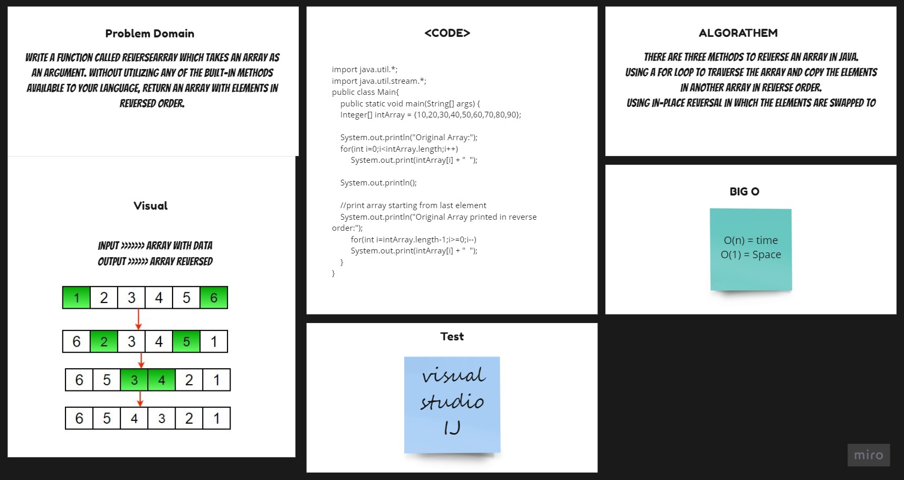

Reversed Array 
-------------------------------
### this challenge is about writing a function which takes an array as argument, and return an array with the reversed values of the original one.
## Challenge
The functions needs to be able to work on arrays of any length.

## Approach & Efficiency
I took the approach I thought was easiest.

## Solution

