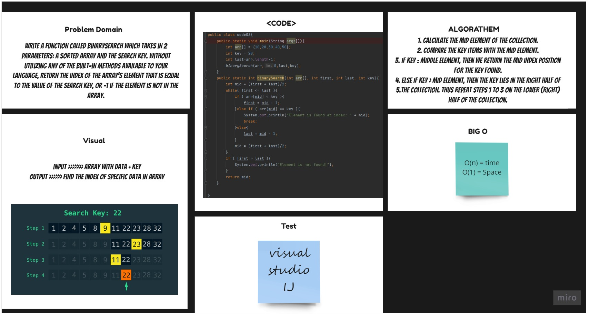

# Binary Search
The function takes an array of integers and an integer and return the index of the array’s element that is equal to the integer, or -1 if the element does not exist. All without using any built-in java methods.

## Challenge
Figuring out the algorithm we were supposed to use and translating it into java

## Approach & Efficiency
I used the Binary Search Algorithm as per the code challenges requirement

## Solution

