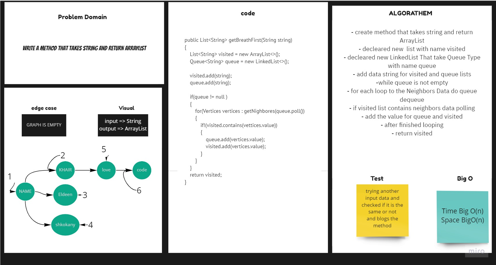

# Graph Breadth First
## Challenge

1. Implement a breadth-first traversal on a graph.

breadth first
Arguments: Node
Return: A collection of nodes in the order they were visited.
Display the collection

## Approach & Efficiency
For each method I took the approach that was most efficient:
- breadthFirst - Big O space of n (linear) and time of O(n) (linear).

## API
* .breadthFirst Return duplicated String Data .

## Solution 

