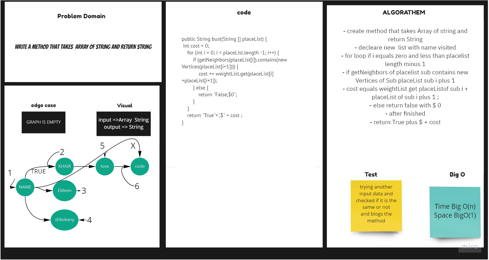

# Graph Business Trip
## Challenge

Write a function called business trip
Arguments: graph, array of city names
Return: cost or null

## Approach & Efficiency
For each method I took the approach that was most efficient:
- breadthBuss - Big O space of 1 (constant) and time of O(n) (linear).

## API
* .breadthBuss Return  String Data .

## Solution 

