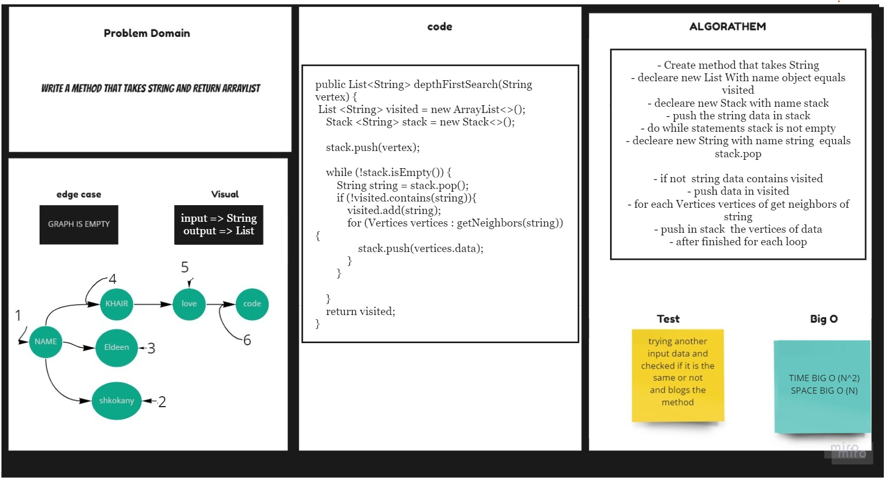

# Graph Breadth First
## Challenge

1. Implement a graph-depth traversal on a graph.

graph depth
Arguments: Node
Return: A collection of nodes in the order they were visited.
Display the collection

## Approach & Efficiency
For each method I took the approach that was most efficient:
- graphDepth - Big O space of n (linear) and time of O(n^2) .

## API
* .graphDepth Return duplicated String Data .

## Solution 

