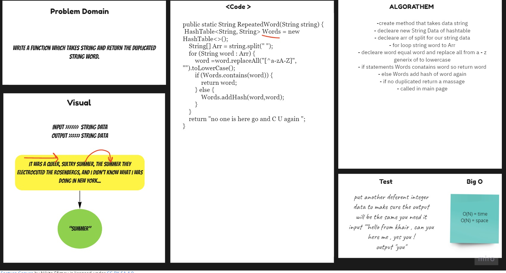

# Hashtables
## Challenge

1. Repeated Words

Arguments: String
- Returns: String
- This method should return string duplicated data.

## Approach & Efficiency
For each method I took the approach that was most efficient:
- RepeatedWords - Big O space of n (linear) and time of O(n) (linear).

## API
* .RepeatedWords Return duplicated String Data .

## Solution 

