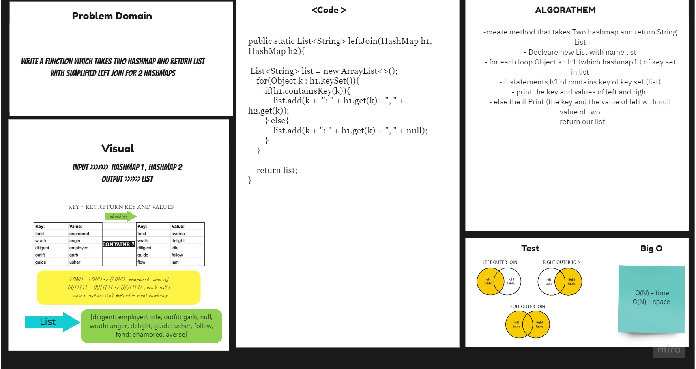

# Tree Intersection
## Challenge
-  simplified LEFT JOIN for 2 Hashmaps.
1. 
Arguments: two hash maps

- The first parameter is a hashmap that has word strings as keys, and a synonym of the key as values.
- The second parameter is a hashmap that has word strings as keys, and antonyms of the key as values.
- Returns: List
- The returned data structure that holds the results is up to you. It doesn’t need to exactly match the output below, so long as it achieves the LEFT JOIN logic.

## Approach & Efficiency
For each method I took the approach that was most efficient:
- RepeatedWords - Big O space of n (linear) and time of O(n) (linear).

## API
* .RepeatedWords Return common values in 2 binary trees.

## Solution 

