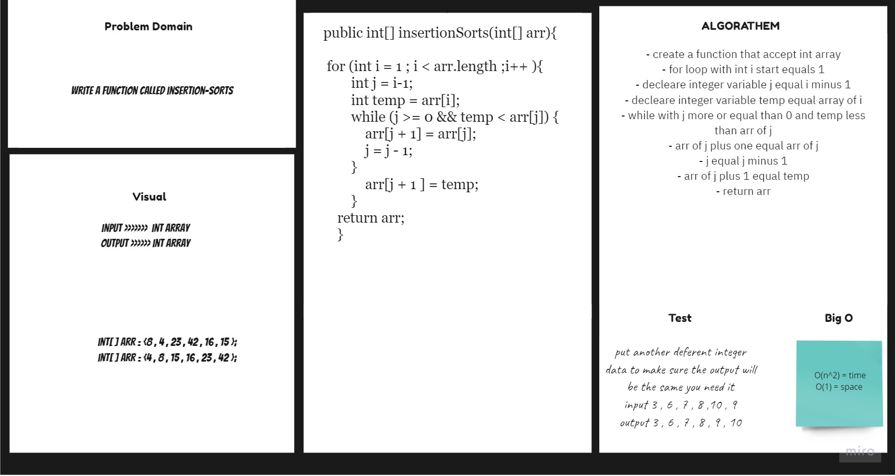
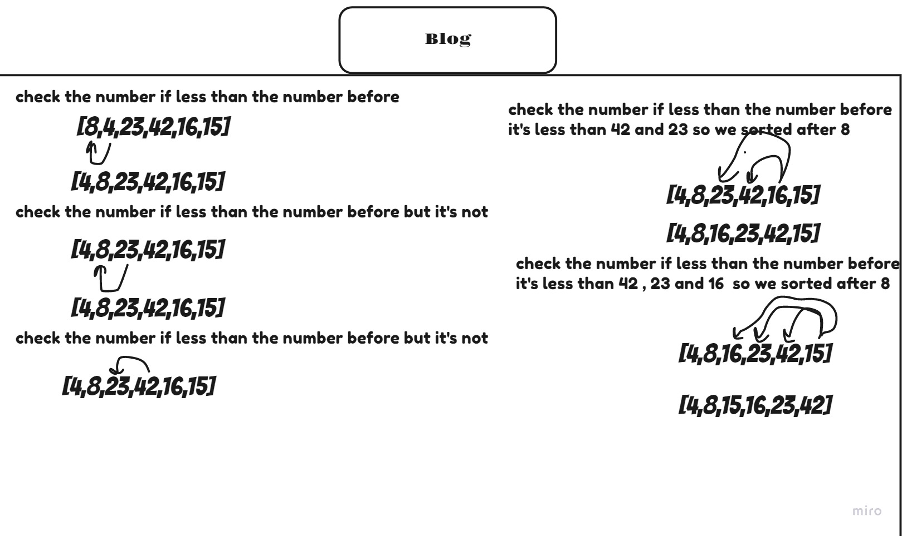

# Insertion Sort
## Challenge
To create function  InsertionSort that accept as parameter of int array and return sort Array .
## Approach & Efficiency
For each method I took the approach that was most efficient:
- InsertionSort - Big O space of 1 (constant) and time of O(n^2) .

## API
* .InsertionSort Return Sorted Array .

## Solution Code :-

## Blog :- 

