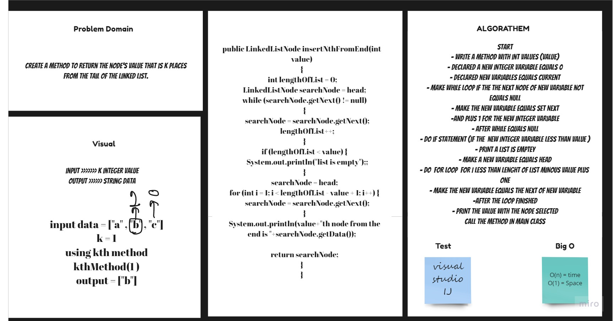

# Linked List "kth method 6 "
Create a LinkedList class which has a head property and 6 methods: insert, includes , insetBefore , insertAfter , insertNthFromEnd and print.
Create a Node class that has properties for the value stored in the Node, and a pointer to the next Node.

## Challenge
Create a LinkedList class which has a head property.
Create a Node class that has properties for the value stored in the Node, and a pointer to the next Node.
Create an insert method which adds a value to the head of the LinkedList.
Create an includes method that tells you if a value is stored in the LinkedList.
Create a print method that prints all the values in the LinkedList to console.
Create a insertBefore method that add a new value before reference value .
Create a insertAfter method that add a new value After reference value .
Create a insertNthFromEnd method that Return the node’s value that is k places from the tail of the linked list. .

## Approach & Efficiency
For each method I took the approach that was most efficient:
- insert(value) - Big O space of n (linear) and time of O(1) (constant).
- includes(value) - Big O space and time of n (linear).
- print() - Big O space and time of n (linear).
- inserBefore() - Big O space and time of n (linear)
- inserAfter() - Big O space and time of n (linear)
- insertNthFromEnd() - O(n) where n is the length of linked list.

## API
* .insert(value) - adds a new node with the value to the head of the list.
* .includes(value) - returns a boolean depending on whether the value exists as a Node’s value somewhere within the list.
* .print() - prints all of the Node values in the Linked List.
* .insertBefore() - insert a new value in linked list before a ref value .
* .insertAfter() - insert a new value in Linked List after a ref value .
* .insertNthFromEnd() - Return the node’s value that is k places from the tail of the linked list.

## Solution

