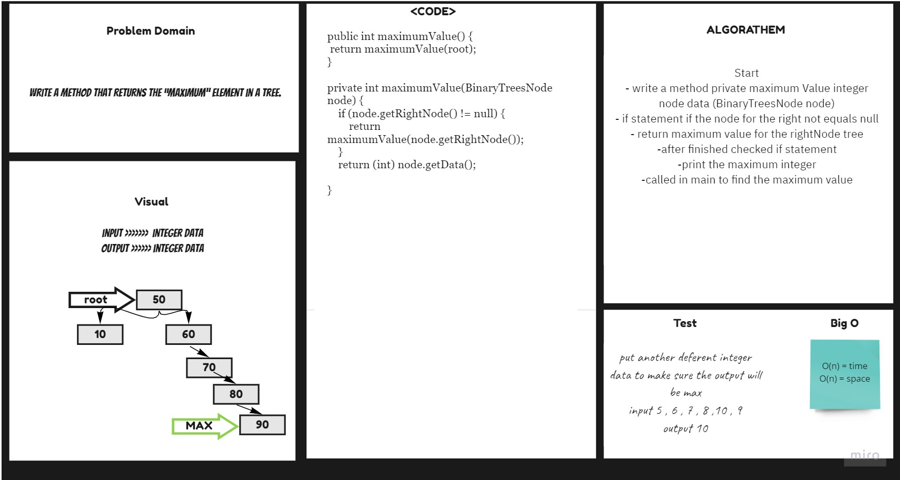

# Maximum Trees

get the Maximum Value  from tree.
## Challenge
Create a maximumValue method that return you a Maximum value in tree .

## Approach & Efficiency
For each method I took the approach that was most efficient:
- MaximumValue - Big O space of n (linear) and time of O(n) (linear).

## API
* .MaximumValue return you a Maximum value in tree.

## Solution Code :-

