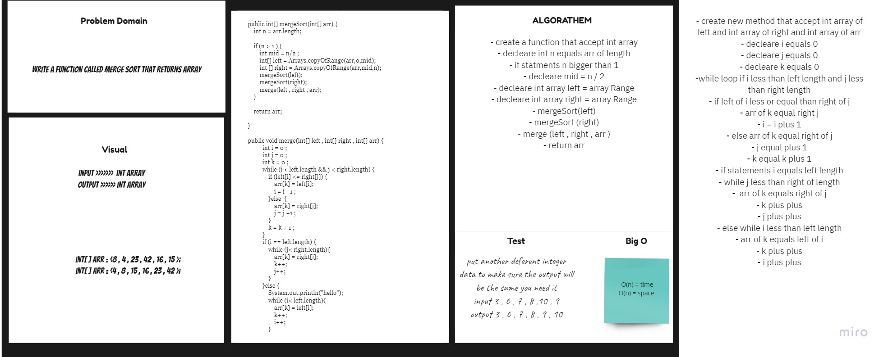

# Merge Sort
## Challenge
To create function  MergeInsert that accept as parameter of int array and return sort Array .
## Approach & Efficiency
For each method I took the approach that was most efficient:
- InsertionSort - Big O space of n (linear) and time of O(n) (linear).

## API
* .MergeInsert Return Sorted Array .

## Solution Code :-

## Blog :- 

