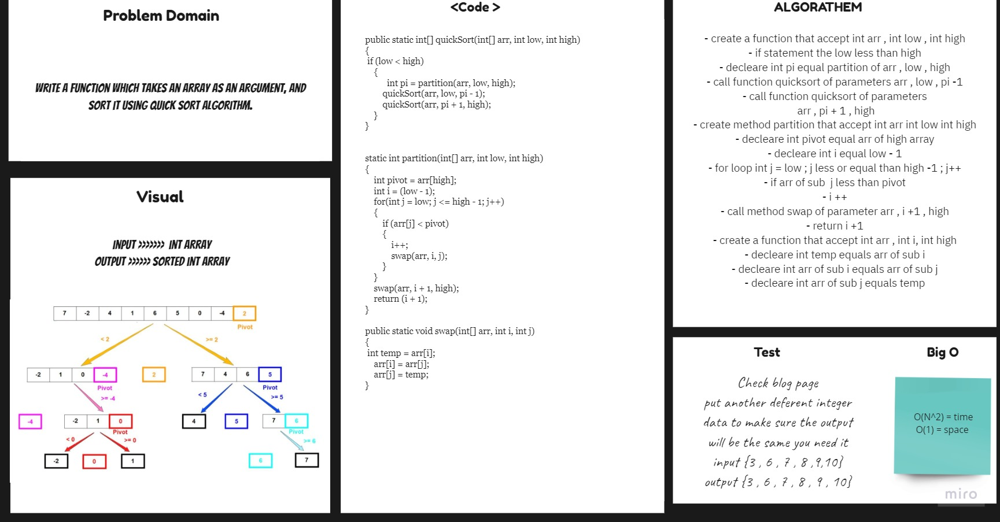
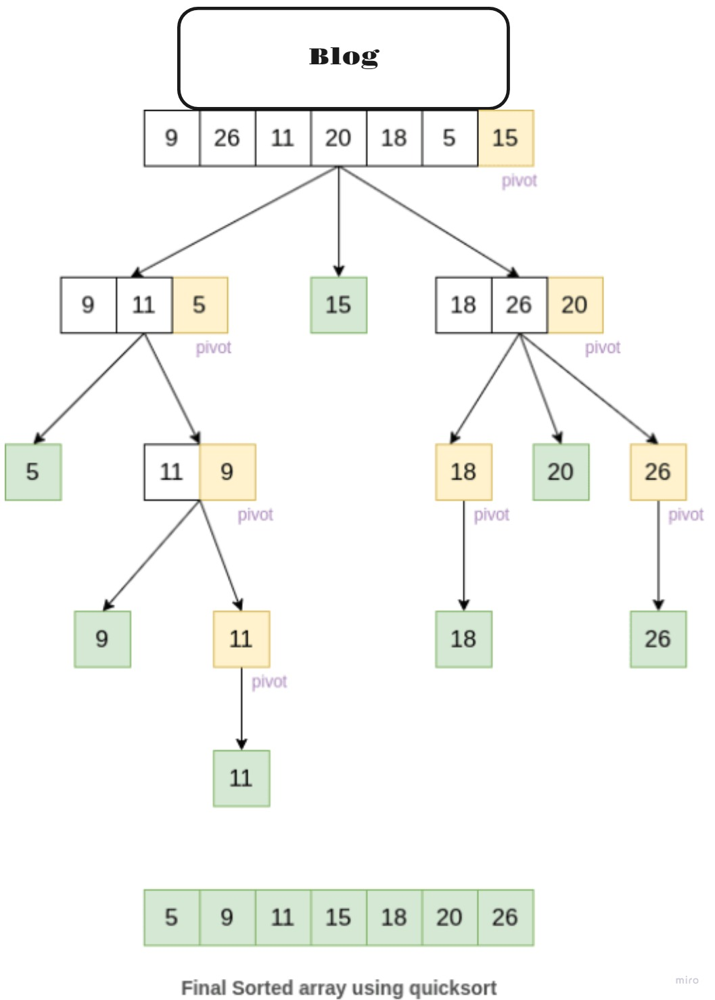

# Merge Sort
## Challenge
To create function  QuickSort that accept as parameter of int array and Low of Length array and High of Array Length and return sort Array .
## Approach & Efficiency
For each method I took the approach that was most efficient:
- InsertionSort - Big O space of 1 (Constant) and time of O(n^2).

## API
* .QuickSort Return Sorted Array .

## Solution Code :-

## Blog :- 

