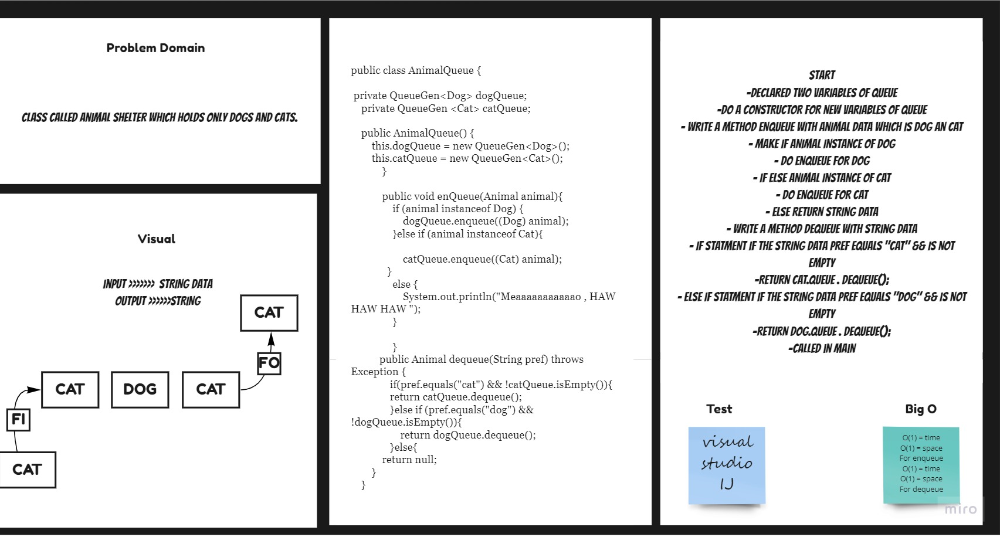

# Stack & Queue - pseudocode
Create a pseudocode class which has 2 methods: enqueue , dequeue .

## Challenge
First-in, First out Animal Shelter.
## Approach & Efficiency
For each method I took the approach that was most efficient:
- enqueue time of n (linear).
- dequeue - Big O space of n (linear) and time of O(1) (constant).

## API
* .enqueue(value) - inside the method using Arguments: animal animal can be either a dog or a cat object.
* .dequeue -  Arguments: pref  ,  pref can be either "dog" or "cat"
  Return: either a dog or a cat, based on preference.
  If pref is not "dog" or "cat" then return null .

## Solution Code :-

