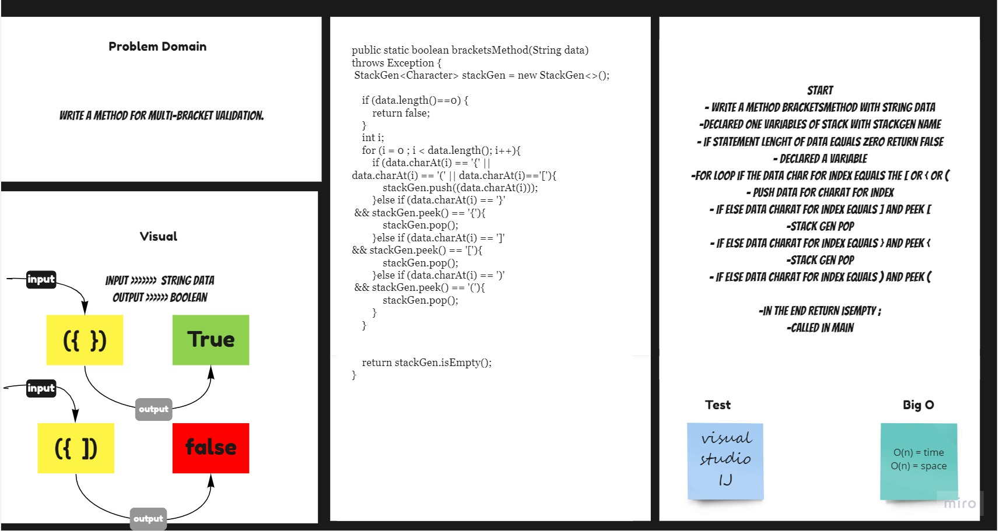

# Stack & Queue - Brackets
Create a Stacks class which has 1 methods: braketsMethod .

## Challenge
Multi-bracket Validation.
## Approach & Efficiency
For this method I took the approach that was most efficient:
- bracketsMethod time & space of n (linear) .

## API
* .bracketsMethod(String value) - inside the method using Arguments: String data can be either a Multi-bracket Validation.

## Solution Code :-

