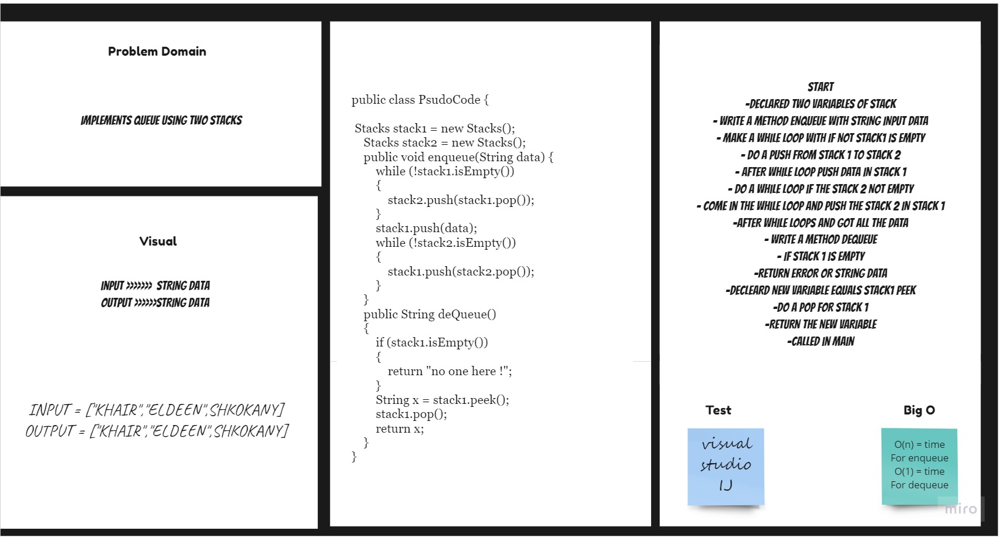

# Stack & Queue - pseudocode
Create a pseudocode class which has 2 methods: enqueue , dequeue by using two stacks.

## Challenge
Using implements for queue using two stacks By first in - first out . 
## Approach & Efficiency
For each method I took the approach that was most efficient:
- enqueue time of n (linear).
- dequeue - Big O space of n (linear) and time of O(1) (constant).

## API
* .enqueue(value) - inside the method using Push a value to stack list By LIFO .
* .dequeue -  inside the method using Pop remove the top value in the stack list.

## Solution Code :-

