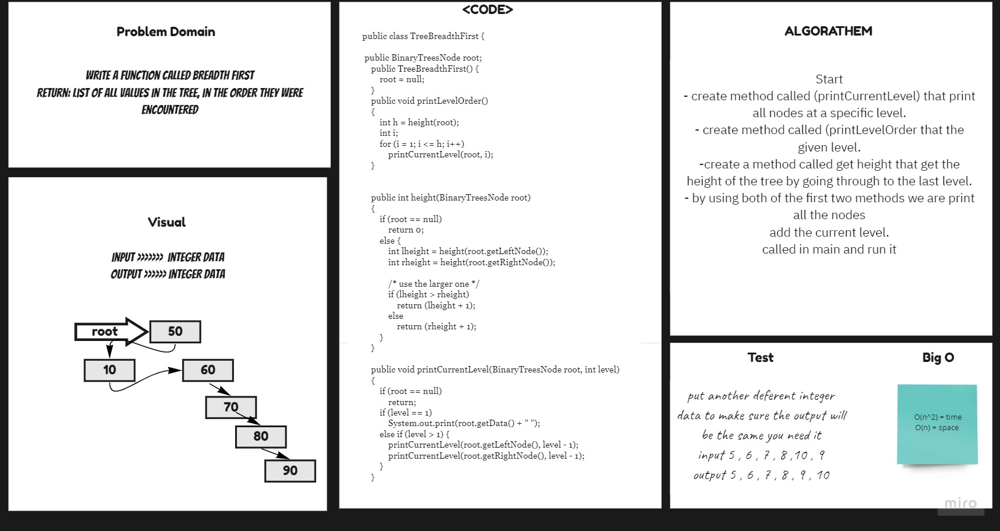

# Tree Breadth First

list of all values in the tree, in the order they were encountered
## Challenge
Write a function called breadth first that Return: list of all values in the tree, in the order they were encountered .
## Approach & Efficiency
For each method I took the approach that was most efficient:
- BreadthFirst - Big O space of n (linear) and time of O(n^2) (Exponential).

## API
* .BreadthFirst Return: list of all values in the tree, in the order they were encountered.

## Solution Code :-

