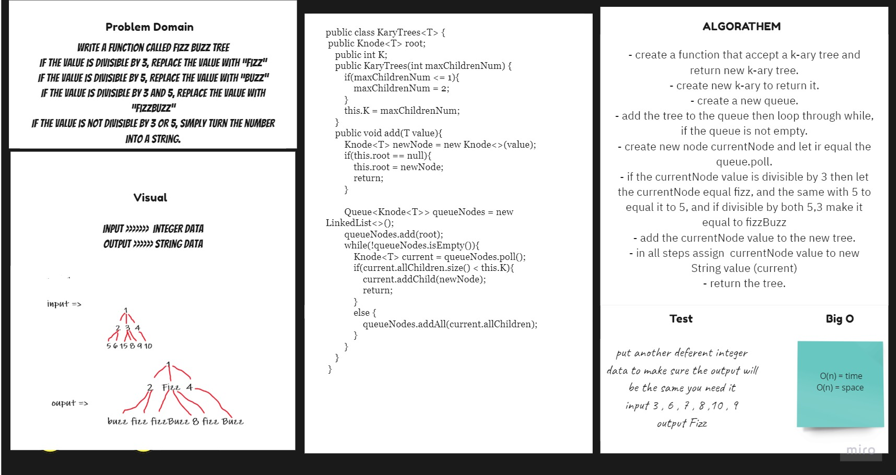

# Tree Fizz Buzz
## Challenge
To create function that accept K-ary tree as parameter and return a k-try tree with values of fuzz if the tree node devisible by 3 and buzz if 3 and fuzzbuzz if divisble by 3 and 5
## Approach & Efficiency
For each method I took the approach that was most efficient:
- KaryTrees - Big O space of n (linear) and time of O(n) (linear).

## API
* .KaryTrees Return: 
- If the value is divisible by 3, replace the value with “Fizz”
- If the value is divisible by 5, replace the value with “Buzz” 
- If the value is divisible by 3 and 5, replace the value with “FizzBuzz” 
- If the value is not divisible by 3 or 5, simply turn the number into a String.

## Solution Code :-

