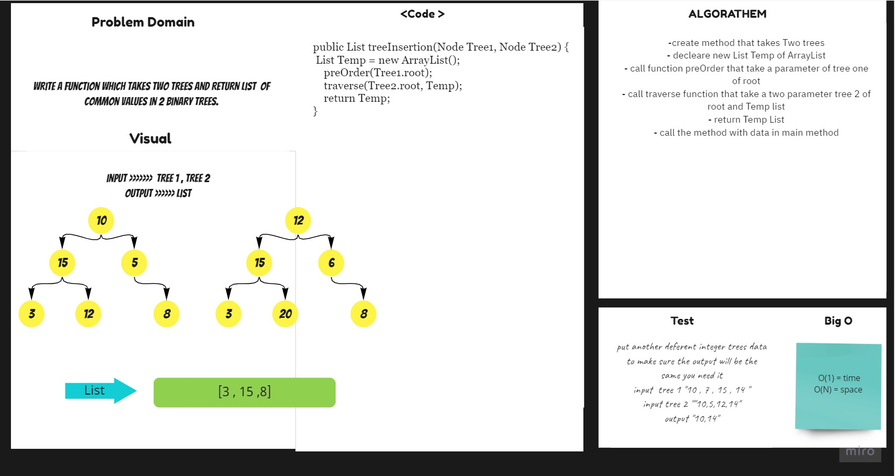

# Tree Intersection
## Challenge
- common values in 2 binary trees.
1. 
Arguments: Tree 1 , Tree 2 
- Returns: List
- This method should return Common Values data in 2 Binary Trees.

## Approach & Efficiency
For each method I took the approach that was most efficient:
- RepeatedWords - Big O space of n (linear) and time of O(1) (Constant).

## API
* .RepeatedWords Return common values in 2 binary trees.

## Solution 

